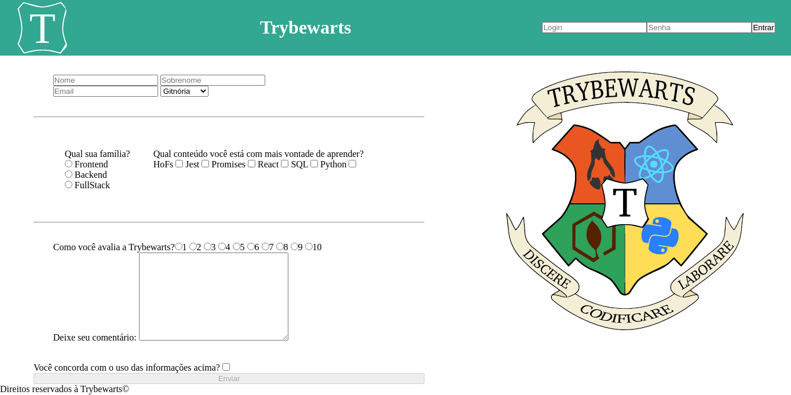

# Trybe Project Trybewarts 21/07/2021
 

  
  
  

 

## Habilidades

- Criar formulários em HTML;
- Utilizar CSS Flexbox para criar layouts flexíveis;
- Criar regras CSS específicas para serem aplicadas a dispositivos móveis;
- Construir páginas que alteram o seu layout de acordo com a orientação da tela.

## Desenvolvimento
Uma [página](https://weltonthomasferreira.github.io/trybe-project-trybewarts/) de formulário da Escola de Magia de Trybewarts, em que as pessoas estudantes poderão enviar seus feedbacks sobre a escola. O tema desse projeto é baseado na obra 'Harry Potter', de J. K. Rowling.

## Resultados

- Projeto em dupla;
- `1` dia de projeto;
- `21` requisitos;
- Percentual de cumprimento de requisitos obrigatórios `100.00%`;
- Percentual de cumprimento de requisitos totais `90.48%`.

